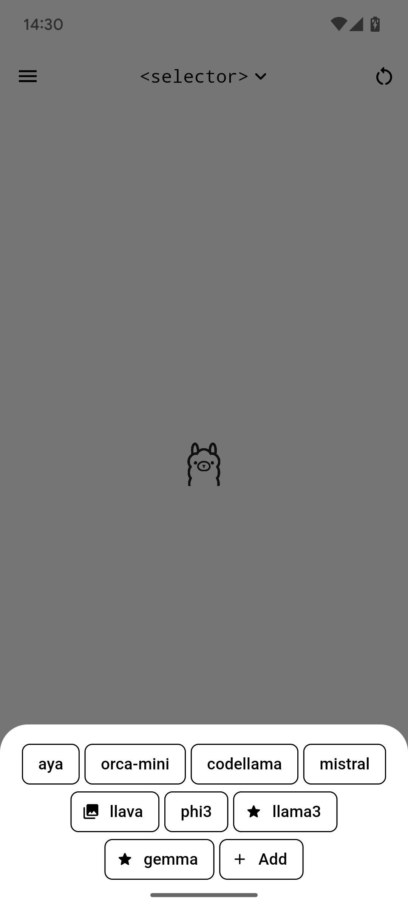
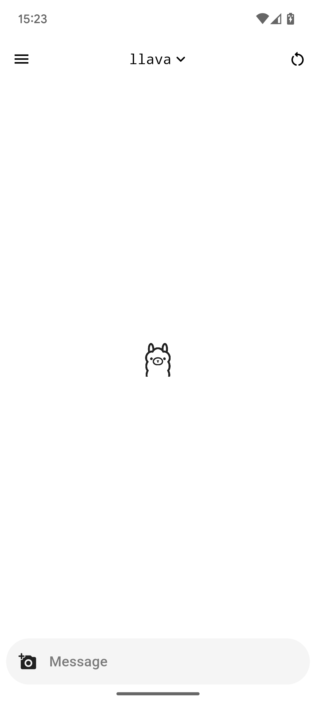
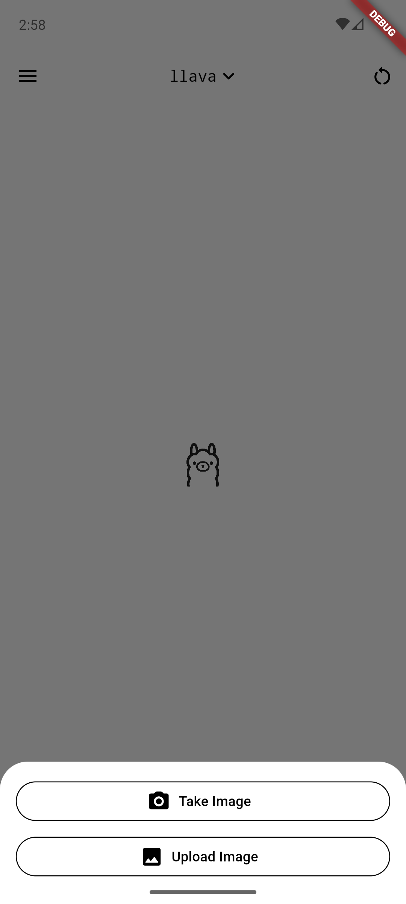
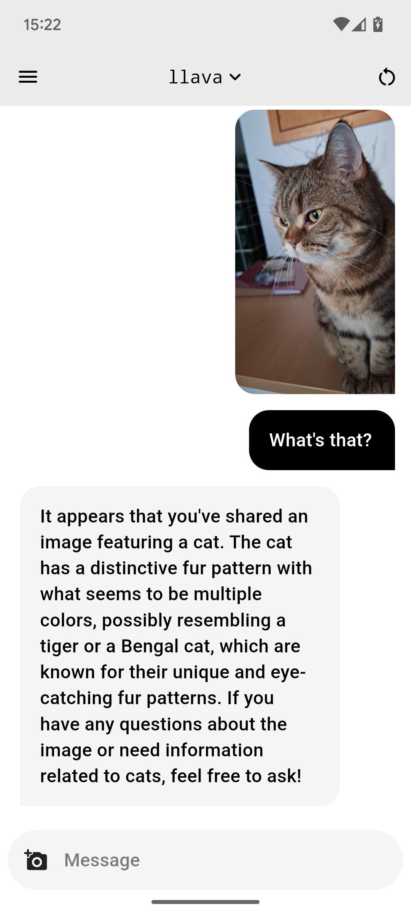
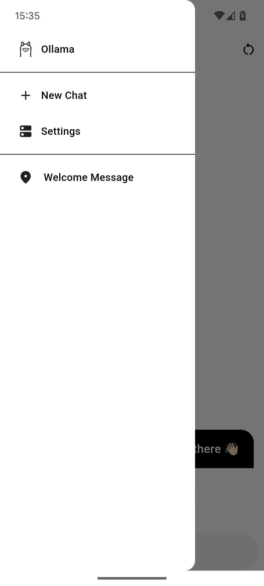
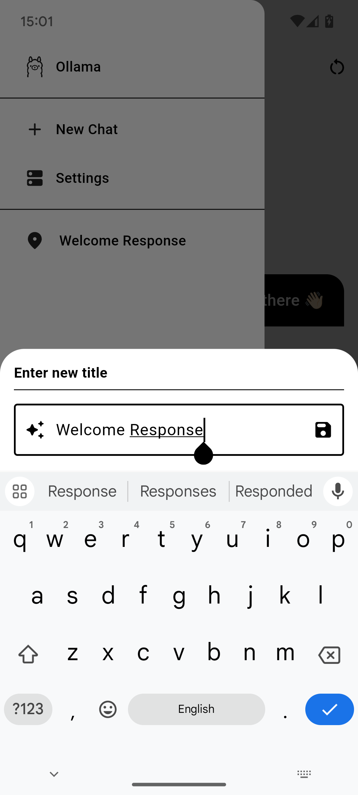
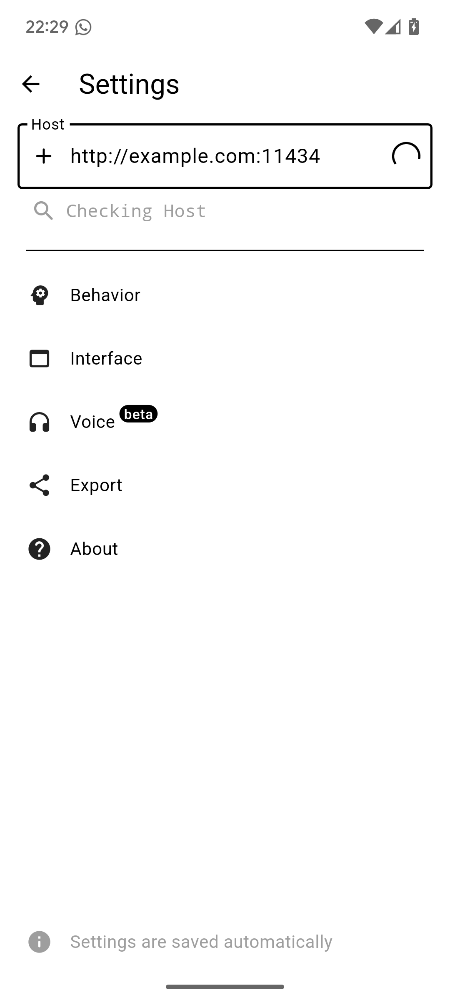
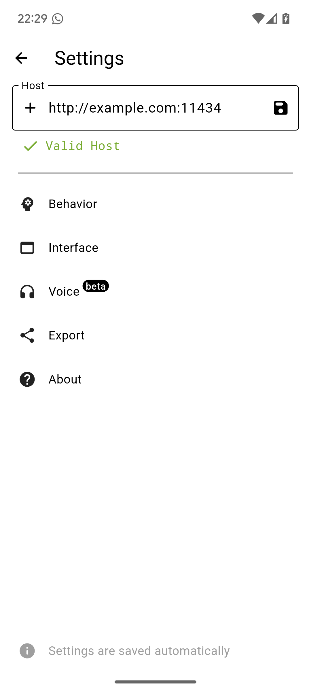
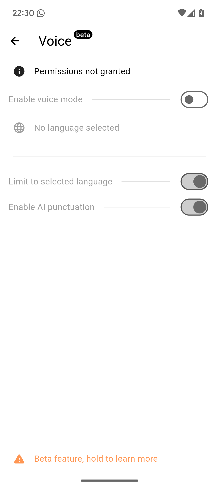
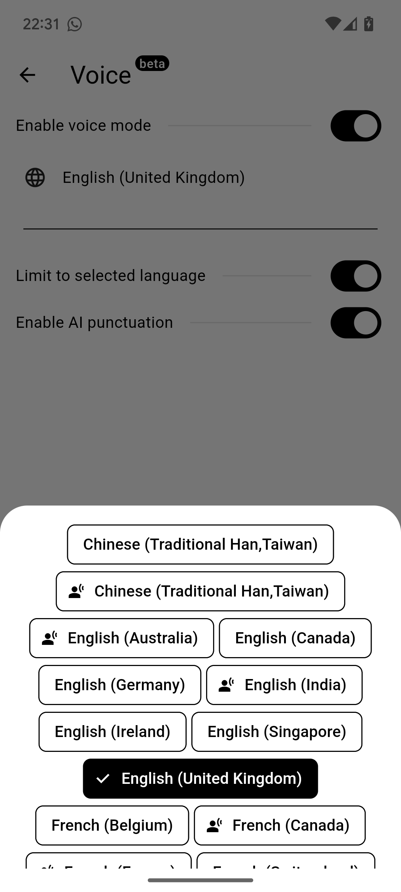

# Ollama App

A modern and easy-to-use client for Ollama. Have the greatest experience while keeping everything private and in your local network.

|  |  |  |  |
|-|-|-|-|

> [!IMPORTANT]
> This app does not host a Ollama server on device, but rather connects to one and uses its api endpoint.
> You don't know what Ollama is? Learn more at [ollama.com](https://ollama.com/).

- [Ollama App](#ollama-app)
  - [Installation](#installation)
  - [Initial Setup](#initial-setup)
  - [Chat View](#chat-view)
    - [Multimodal Input](#multimodal-input)
  - [Model Selector](#model-selector)
  - [Side Menu](#side-menu)
  - [Settings](#settings)
    - [Host](#host)
      - [Custom headers](#custom-headers)
    - [Behavior](#behavior)
    - [Interface](#interface)
    - [Voice](#voice)
    - [Export](#export)
    - [About (and Updates)](#about-and-updates)
  - [Multilingual Interface](#multilingual-interface)
  - [Custom Builds](#custom-builds)
    - [Actually Building](#actually-building)

## Installation

You'll find the latest recommended version of the Ollama App under [the releases tab](https://github.com/JHubi1/ollama-app/releases). Download the APK and install it on your Android device. That's it, now proceed to [Initial Setup](#initial-setup).

Alternatively, you can also download the app from any of the following stores:

[](https://apt.izzysoft.de/fdroid/index/apk/com.freakurl.apps.ollama/)

## Initial Setup

After installing the app and opening it for the first time, you'll encounter this popup:


Go through the welcome dialog one by one, you should read their content, but you don't have to.

|  |  |  |
|-|-|-|

After going through that, you'll get a small snack bar notifying you that you have to set the host. For that, open the sidebar (swipe from the left to right or click the icon in the top left corner) and click on settings. There you'll find all app-related settings, you should go through them, but for the initial setup, only the first one is important.

In the big host text field, you have to enter the base URL of your instance. The port is required unless the port number matches the protocol (443 for HTTPS or 80 for HTTP). After that, click the save icon right next to the text field.

To learn more about the host setting, visit [Settings](#host)

> [!IMPORTANT]
> The Ollama server needs additional steps to be asccessible from without the local machine. To learn more, visit issue #5

That's it, you can now just chat. Enter a message into the box at the bottom and click the send icon.

## Chat View

This is the main view of the app, simple and, most importantly, working.

> [!NOTE]
> To start chatting, you first have to select a model in the [Model Selector](#model-selector). Do that first, then come back here.

The chat mode is straightforward. Just write a message, wait a few moments, and the answer will get sent into the chat.

The chat view hides a few useful features already included by default. Messages can be deleted by double-tapping the message you desire to wipe from the earth, and all messages sent since then, including the message itself, will get deleted.

Editing a message is almost as simple. After enabling message editing in [Interface Settings](#interface), simply long press on a message and a popup will open and ask for the new content.


> [!TIP]
> Messages (almost) fully support markdown syntax. That means the AI will be able to recieve and send back the message in markdown.

### Multimodal Input

Ollama App supports multimodal models, models that support input via an image. Models supporting the technology are marked with an image icon next to their name in the [Model Selector](#model-selector).

After selecting a multimodal model, a new icon appears at the bottom left of the message bar; a camera icon. Clicking on it reveals the following bottom sheet:

|  |  |  |
|-|-|-|

Select one of them, take or select your photo and it'll get added to the chat. Adding multiple images is allowed, just repeat the steps.

Even though the images will appear in the chat already after sending, they won't be submitted to the AI until a new text message is sent. When you send a message the AI will answer the message in consideration of the image.

## Model Selector

You can access the model selector by tapping on the `<selector>` text in the top middle or the name of the currently selected model in the same spot. Then you'll get the following popup dialog:


This will display all the models currently installed on your Ollama server instance.

The models with a star next to them are recommended models. They have been selected by me (hehe) to be listed as that. Read more under [Custom Builds](#custom-builds).

The `Add` button does nothing at the moment, it just opens a snack bar listing steps on how to add a model to an instance. For safety reasons, I didn't add the ability to add a model directly via name in the app.

Models supporting [Multimodal Input](#multimodal-input) are marked with an image icon next to their name, like `llava` in the image above.

## Side Menu

The button on the top left opens the menu. In it, you have two options: `New Chat` and `Settings`. The first option creates a new chat, and the second one opens the [Settings](#settings) where you can change how everything works.

Below that are all the chats. To delete one, swipe it from left to right. To rename the chat tab and hold it until a popup dialog appears. In it, you can change the title or tab the sparkle icon to let AI find one for you. This is not affected by the "generate title" setting.

| |  |  |
|-|-|-|

> [!NOTE]
> The button on the top right corner deletes the chat. It has the same effect as swiping the chat in the sidebar.

## Settings

Ollama App offers a lot of configuration options. We'll go through every option one by one.

### Host

The host is the main address of your Ollama server. It may include a port, a protocol and a hostname. Paths are not recommended.

|  |  |  |
|-|-|-|

The port is required unless the port number matches the protocol (443 for HTTPS or 80 for HTTP). After that, click the save icon right next to the text field to set the host.

The host address will be checked, so no worry about entering the wrong one. If you set the host once, and your server is offline, the requests will fail, but the host will stay saved if you don't change it yourself. To do that, just go into the side menu and open settings to do so.

#### Custom headers


Ollama App supports adding custom headers. This can be useful in case you want to secure your instance with authentification or something similar. Simply press the plus icon next to the host input and set one as a JSON object. This could be for example:

```json
{
  "Authorization": "Bearer <token>"
}
```

### Behavior


The behavior settings include settings connected to the system prompt. They won't be applied until you create a new chat.

The system prompt is sent to the assistant at the start of the conversation. It leads the assistant in a direction and it'll talk like you told him to in this message. To reset the system prompt to default, empty its value, click the save icon and close the screen.

The option to disable markdown is not safe and the assistant can still potentially add markdown to its response.

### Interface


The interface settings are focused, as the name might imply, on the interface of the Ollama App. The following list will document all options

1. Targeted at the [Model Selector](#model-selector).
   1. Show model tags in the model selector. This can be useful if you have multiple versions of the same model installed
   2. Clear the chat if the model is changed. This is highly recommended, disabling this option could lead to unintended behavior
2. Used in the [Chat View](#chat-view)
   1. Set the request mode. Streaming is recommended, but sometimes it's not available, then select "Request"
   2. Whether to generate titles of chats with the Ollama AI or not. Could higher potential quota costs
   3. Whether long-pressing messages opens the edit dialog or not
   4. Whether to ask before deletion of chats. Useful if important data is potentially stored in chats or not
   5. Whether to show tips in the main sidebar
3. Backend loading options
   1. Keep model always loaded (`keep_alive` to `-1`)
   2. Never keep model (`keep_alive` to `0`)
   3. Time to keep models alive
4. Appearance settings
   1. Whether to enable haptic feedback or not
   2. Whether to start windows maximized (only desktop)
   3. Theme of app
   4. Follow the device theme/color

### Voice

> [!WARNING]
> This is still an experimental feature! Some functions may not work as intended!

|  |  |  |
|-|-|-|

Tap the "Permissions not granted" button to allow the needed permissions. They're needed to allow Speach To Text to function.

After that, enable Voice Mode by switching the toggle. To bring it to work, you now have to press "No language selected" and select a language in the language dialog. That's it.

Then, press the button on the spot where the attachment icon would be with a multimodal model or press the photo icon and the "Voice" button.


> [!NOTE]
> Documentation will be properly added once this feature leaves experimental phase

### Export


The export function allows you to export and save all chats to a file. This can be very useful if you want to back up your data or want to sync it between devices.

> [!WARNING]
> The import functionallity deletes all currently saved chats from disk and replaces them with the ones from the file. This cannot be undone.

### About (and Updates)


The About screen holds a lot of useful information.

You can access the GitHub repository or the issue page of the app directly from this screen.

One more useful thing is the update checker. It looks for updates in the repo and will prompt you to download them directly from GitHub. Be careful though, the used GitHub API has a rate limit. You can only send a few requests before the rate limit kicks in.

## Multilingual Interface

Ollama App does support multiple languages. Currently available are:

- [x] English (fallback)
- [x] German

In case the language you're looking for isn't listed, you can check if the development is in progress on the [Crowdin project page](https://crowdin.com/project/ollama-app). If not, you can always contribute.

## Custom Builds

Now it's going to get interesting. The app is built in a way so you can easily create custom builds. Currently, there are these values that can be customized:

```
// use host or not, if false dialog is shown
const useHost = false;
// host of ollama, must be accessible from the client, without trailing slash, will always be accepted as valid
const fixedHost = "http://example.com:11434";
// use model or not, if false selector is shown
const useModel = false;
// model name as string, must be valid ollama model!
const fixedModel = "gemma";
// recommended models, shown with as star in model selector
const recommendedModels = ["gemma", "llama3"];
// allow opening of settings
const allowSettings = true;
// allow multiple chats
const allowMultipleChats = true;
```

They can be found at the top of `lib/main.dart`. `useHost` and `useModel` decide whether you want `fixedHost` and `fixedModel` to control anything. `fixedHost` and `fixedModel` decide about the value that has to be used. That can be practical in case you try to create an app specific to your instance.

`recommendedModels` is a list of models that will be listed as recommended in the [Model Selector](#model-selector). They are more like personal preferences. If empty, no model will be preferred.

`allowSettings` will disable the settings screen. But it will also disable the welcome dialog at first startup and the ability to rename chats.

`allowMultipleChats` simply removes the `New Chat` option in the [Side Menu](#side-menu). And will load up the only available chat on app startup.

### Actually Building

But how do you create a custom build?

First, follow [the Flutter installation guide](https://docs.flutter.dev/get-started/install) by selecting Android as the first app type. Then follow [these steps](https://docs.flutter.dev/deployment/android#signing-the-app) till you have your custom `key.properties`. Place it into the `android` folder at the root of the project.

Make sure dart is available as a command or added as the default program for `.dart`. Then execute `scripts/build.dart` and wait for it to finish processing. Then go to `build/.output`. There you'll find everything you need, the normal Android app and the experimental Windows build.
