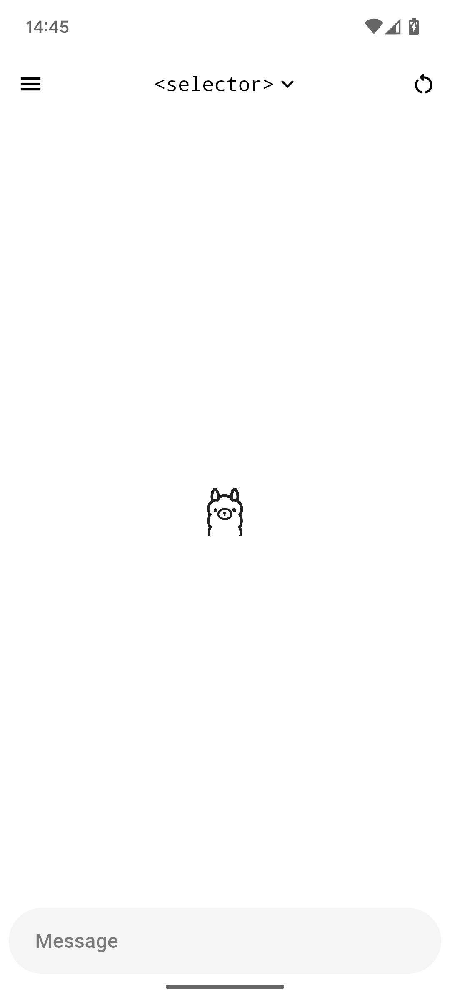
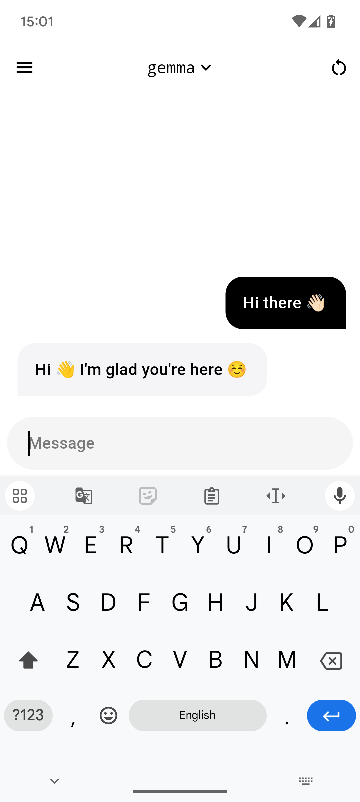
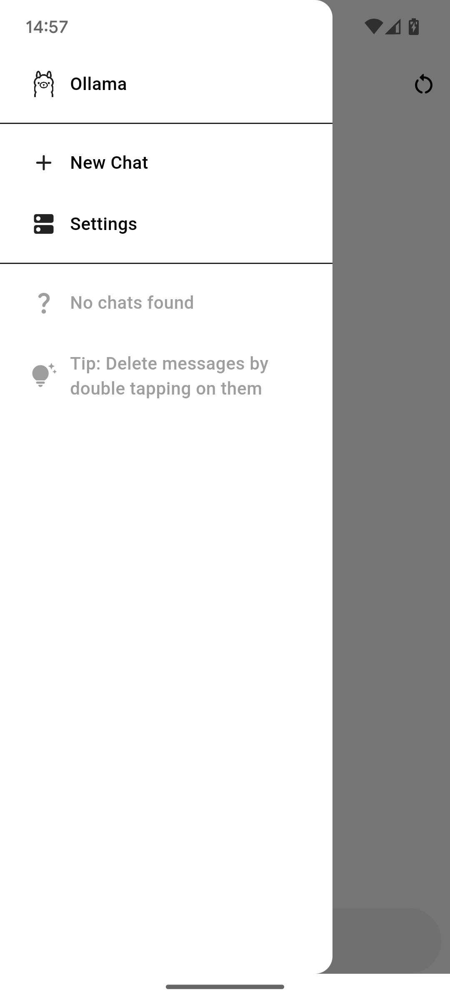

# Ollama App

A modern and easy-to-use client for Ollama. Have the greatest experience while keeping everything private and in your local network.

|  |  |  |  |
|-|-|-|-|

> [!IMPORTANT]
> This app does not host a Ollama server on device, but rather connects to one using its api endpoint.
> You don't know what Ollama is? Learn more at [ollama.com](https://ollama.com).

## Getting Started

Ollama App has a pretty simple and intuitive interface to be as open as possible. Everything just works out of the box, you just have to follow the next steps.

### Installation

You'll find the latest recommended version of the Ollama App under the [releases tab](https://github.com/JHubi1/ollama-app/releases). Download the correct executable onto your device and install it. If you want to install on a desktop platform, you might also have to follow the steps listed below, under [Ollama App for Desktop](#ollama-app-for-desktop).

Alternatively, you can also download the app from any of the following stores:

<!--  -->

That's it, you've successfully installed Ollama App! Now just proceed to [Initial Setup](https://github.com/JHubi1/ollama-app/wiki/Getting-Started#initial-setup) or alternatively [Setup](#setup) below.

### Ollama App for Desktop

> [!WARNING]
> This is still an experimental feature! Some functions may not work as intended. If you come across any errors, please create a new [issue report](https://github.com/JHubi1/ollama-app/issues/new/choose).

There are a few things you might have to keep in mind if you're planning to use the experimental desktop support.

#### Windows

The Windows version is provided in the form of an installer, you can find it attached on the [latest release](https://github.com/JHubi1/ollama-app/releases). It's not signed, you might have to dismiss the Windows Defender screen by pressing "View More" > "Run Anyway".

Windows app data is kept at: `C:\Users\[user]\AppData\Roaming\JHubi1\Ollama App`

#### Linux

The Linux version is provided in the form of a portable executable, you can find it attached on the [latest release](https://github.com/JHubi1/ollama-app/releases). To start it, execute `./ollama` in the extracted folder.

If a message like `error while loading shared libraries: libgtk-3.so.0: cannot open shared object file` appears when you start the app, run the following commands:

- `sudo apt-get update`
- `sudo apt-get upgrade`
- `sudo apt-get install packagekit-gtk3-module`

Linux app data is kept at: `/home/[user]/.local/share/ollama`

### Setup

The most difficult part is setting up the host. To learn more visit the [wiki guide on how to do so](https://github.com/JHubi1/ollama-app/wiki/Getting-Started#setting-up-the-host). After setting up, you normally don't have to enter it again.

And you're done! Just start chatting with your local AI and have fun!

> [!TIP]
> The new Voice Mode is now avaliable as an experimental feature. Learn more about it in [the documentation](https://github.com/JHubi1/ollama-app/wiki/Components#voice).

## Documentation

The documentation for components, settings, functions, etc. has moved to the [Wiki Page](https://github.com/JHubi1/ollama-app/wiki) of this repository. The steps there will be updated with future versions. Still having questions? Feel free to open an issue.

## Translations and Contribution

You want to help me make this project even better? Great, help is always appresheated.

Ollama App is created using [Flutter](https://flutter.dev), a modern and robust frontend framework designed to make a single codebase run on multiple target platforms. The framework itself is based on the [Dart](https://dart.dev) programming language.

Read more in the [Contribution Guide](https://github.com/JHubi1/ollama-app/wiki/Contributing).

## Star History

## iOS
In order to support iOS, check out the repository to ollama_app instead of ollama-app.
Then execute the command 
flutter create --platform=ios .
